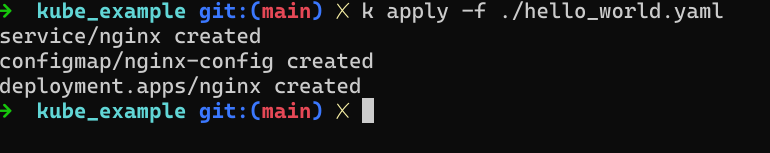
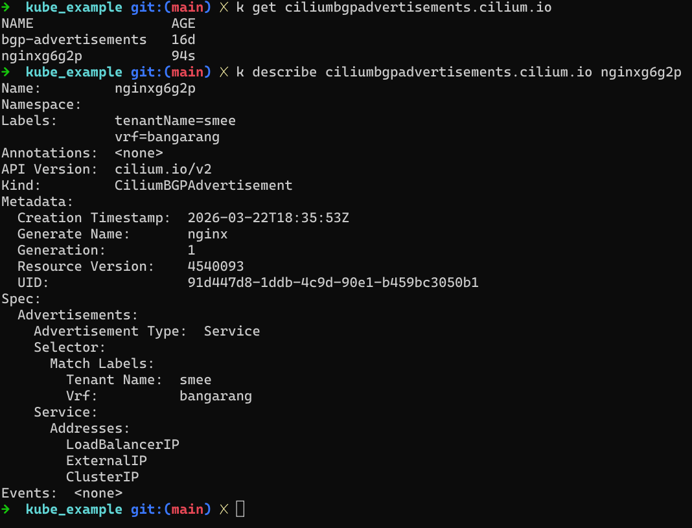
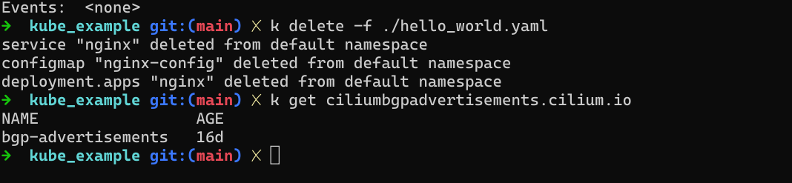
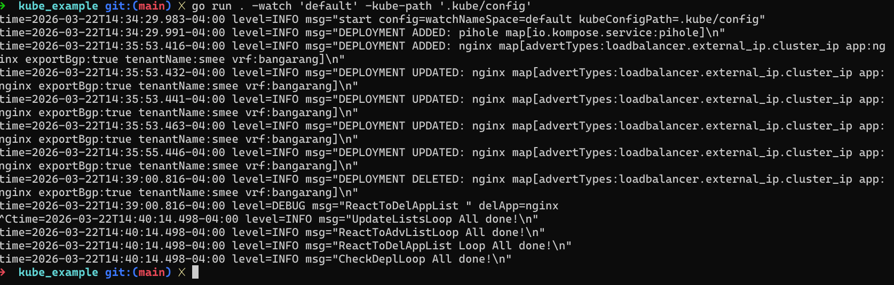

# Kube-Example
An example of integrating a simple watchdog service, Cilium, and Kuberentes; written in Go.

## Requirements

- Go/Golang v1.25.6
- Access to a Kubernetes cluster & a kube config somewhere in the user $HOME dir
- Cilium installed & setup in said kube cluster

## What it does

Run with:

```bash
go run . -watch 'default' -kube-path ".kube/config"
```

This spawns a k8s client package Kube Deployment ListWatcher. The watcher is given a set of handlerFuncs; add, update, & delete.

> [!NOTE]
> This only creates the CiliumBGPAdvertisement. In order to form a peering and advertise BGP you'll also need (at minimum) CiliumBGPClusterConfig and CiliumBGPPeerConfig daemon sets, with corresponding labels and selectors. More information can be found at the official [Cilium Docs](https://docs.cilium.io/en/stable/network/bgp-control-plane/bgp-control-plane-configuration/).


### App flow

On add:
  - send to depl_add channel
  - create AnApp & add to globalAppList
  - send globalAppList to appChan


On update:
  - send to depl_upd channel
  - create AnApp & send to globalAppList
  - send globalAppList to appChan


On delete:
  - send to depl_del channel
  - create AnApp & send to delAppchan 

  
Read globalAppList:
  - check and compare if app already exists/is catalogued
  - if not create NewCiliumBGPAdvert and send to advChan


Read advChan:
  - apply CiliumBGPAdvert.manifest to Kubernetes cluster, creates CiliumBGPAdvertisement with selector labels pulled from Deployment


Read delAppChan:
  - check if app Deployment exists as CiliumBGPAdvert, if so:
  - check if any other app Deployments exist with labels matching CiliumBGPAdvert, if not:
  - remove CiliumBGPAdvert from Kubernetes cluster


### Example

With the watchdog service running with:

```bash
go run . -watch 'default' -kube-path ".kube/config"
```

Apply the included ```hello_world.yaml``` :

```bash
kubectl apply -f ./hello_world.yaml
```
### Deployment 
<p align="left"></p>

### Result
<p align="left"></p>
<p align="left"></p>

#### App Log
<p align="left"></p>
